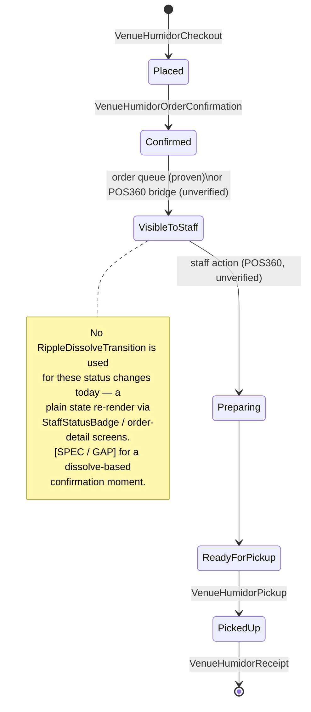

# Customer Order Status Updates

```mermaid
stateDiagram-v2
    [*] --> Placed: VenueHumidorCheckout
    Placed --> Confirmed: VenueHumidorOrderConfirmation
    Confirmed --> VisibleToStaff: order queue (proven)\nor POS360 bridge (unverified)
    VisibleToStaff --> Preparing: staff action (POS360, unverified)
    Preparing --> ReadyForPickup
    ReadyForPickup --> PickedUp: VenueHumidorPickup
    PickedUp --> [*]: VenueHumidorReceipt

    note right of VisibleToStaff
        No RippleDissolveTransition is used
        for these status changes today — a
        plain state re-render via
        StaffStatusBadge / order-detail screens.
        [SPEC / GAP] for a dissolve-based
        confirmation moment.
    end note
```
