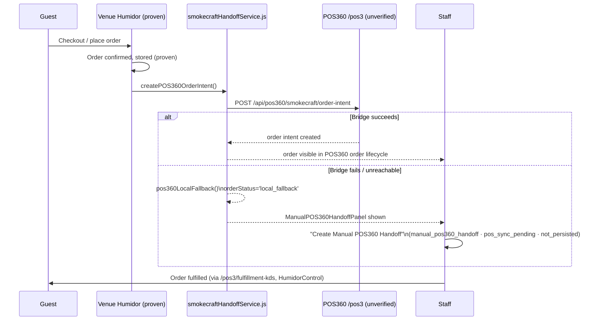

# Customer → POS360 Handoff

Status: real code on both sides; the bridge's live success path is
**not** proof-verified. The local-fallback/manual path is real, working,
and explicitly disclosed as non-persistent.
