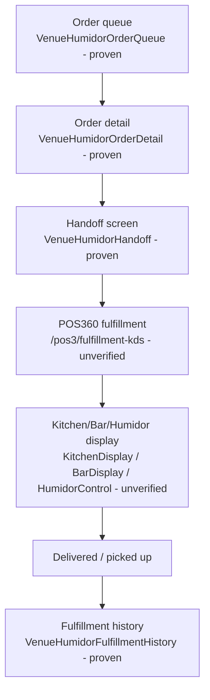

# Fulfillment Lifecycle

```mermaid
flowchart TD
    A[Order queue\nVenueHumidorOrderQueue - proven] --> B[Order detail\nVenueHumidorOrderDetail - proven]
    B --> C[Handoff screen\nVenueHumidorHandoff - proven]
    C --> D[POS360 fulfillment\n/pos3/fulfillment-kds - unverified]
    D --> E[Kitchen/Bar/Humidor display\nKitchenDisplay / BarDisplay / HumidorControl - unverified]
    E --> F[Delivered / picked up]
    F --> G[Fulfillment history\nVenueHumidorFulfillmentHistory - proven]
```
