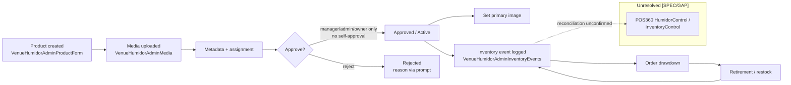

# Inventory Lifecycle (Venue Humidor — proven)

```mermaid
flowchart LR
    A[Product created\nVenueHumidorAdminProductForm] --> B[Media uploaded\nVenueHumidorAdminMedia]
    B --> C[Metadata + assignment]
    C --> D{Approve?}
    D -->|manager/admin/owner only\nno self-approval| E[Approved / Active]
    D -->|reject| F[Rejected\nreason via prompt]
    E --> G[Set primary image]
    E --> H[Inventory event logged\nVenueHumidorAdminInventoryEvents]
    H --> I[Order drawdown]
    I --> J[Retirement / restock]
    J --> H

    subgraph "Unresolved [SPEC/GAP]"
    K[POS360 HumidorControl /\nInventoryControl]
    end
    H -.reconciliation unconfirmed.-> K
```
