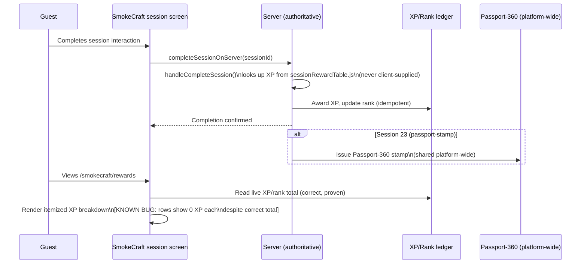

# Passport and Rewards Update (proven)

Status: proven live and server-authoritative for the completion+XP
mechanism itself; the itemized breakdown display bug is a real, disclosed,
non-blocking limitation (see `17-KNOWN-LIMITATIONS...md`).
