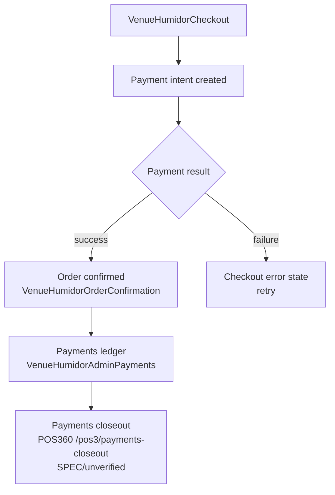

# Payment Lifecycle (high-level, non-invasive)

Note: this diagram deliberately stays at the UI-flow level. Payment
gateway internals are out of scope for this documentation pass — a
concurrent agent may be implementing real payment-gateway integration in
this same repo/branch, and payment logic was explicitly excluded from
this task's scope.
