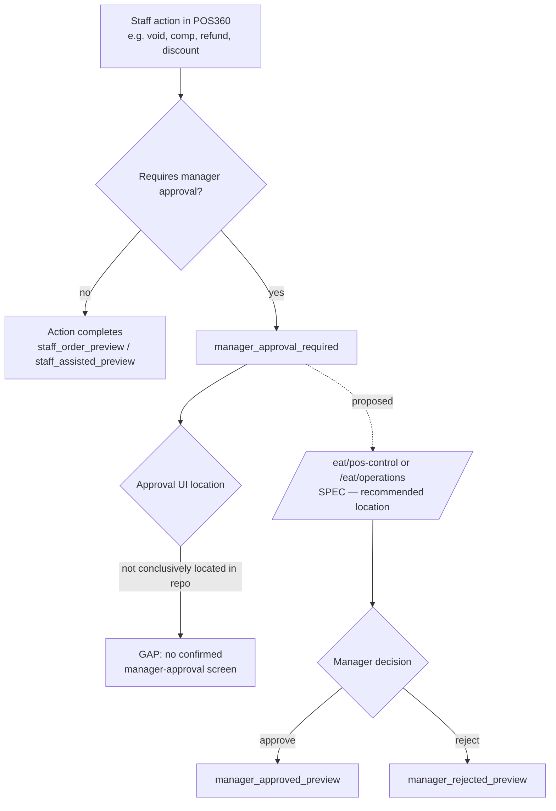

# POS360 → E.A.T. 360 Escalation

Status: the escalation *states* (`manager_approval_required`,
`manager_approved_preview`, `manager_rejected_preview`) are real, defined
in `StaffStatusBadge.jsx`. The concrete screen where a manager actually
approves/rejects was not conclusively located in this codebase during
this documentation pass — flagged as a real implementation gap, not
fabricated as existing.
