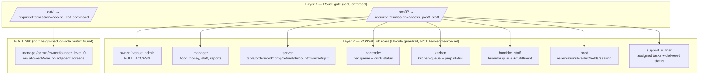

# Staff and Manager Permissions

Status: Layer 1 is real and enforced server/route-side. Layer 2 is real
code but explicitly self-documented as a UI-only guardrail requiring a
future backend-enforced staff-identity layer for production use. E.A.T.
360 has no equivalent fine-grained matrix in this codebase today.
