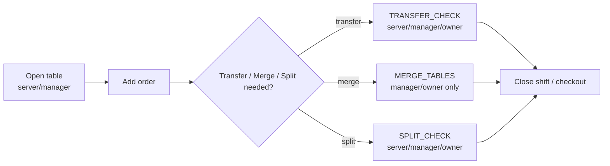

# Table / Tab Transfer

## Status: partially real, N/A for the customer-facing SmokeCraft product

`POS360_ACTIONS.TRANSFER_CHECK`, `MERGE_TABLES`, and `SPLIT_CHECK` are
real, defined actions in `src/modules/pos360Permissions.js`, gated to
`owner/venue_admin`, `manager`, and `server` roles (see
`03-USER-ROLES-AND-RBAC.md`). `src/components/staff/TableCard.jsx` and
`TableActionMenu.jsx` exist as real UI components, and `/pos3/tables`,
`/pos3/venue-tables` (`POS360TableManagement`) are real routed screens.

However:

- No screenshot or API proof exists confirming a live transfer/merge/
  split flow.
- SmokeCraft's own customer/Venue Humidor product concept has **no table
  or tab concept at all** — it is a pickup/order-tracking model, not a
  dine-in tab model. This diagram is therefore **N/A to the SmokeCraft
  customer journey** and applies only to POS360's general hospitality
  floor-management feature set, which serves the venue's broader
  restaurant/bar operations beyond SmokeCraft-originated orders.

Status: **[SPEC / unverified]** — real permission model and UI
components exist; live behavior not proven.
